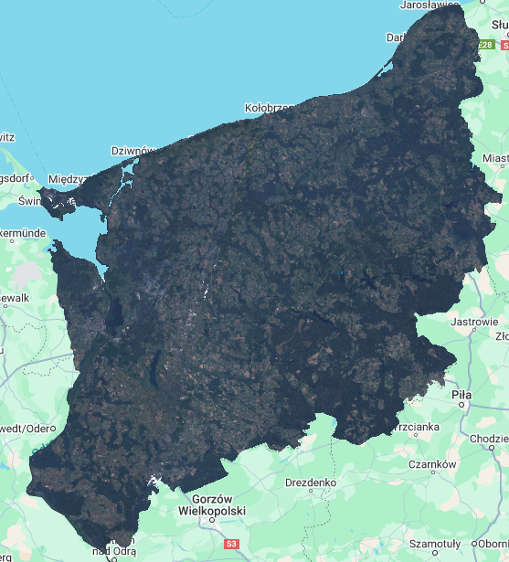
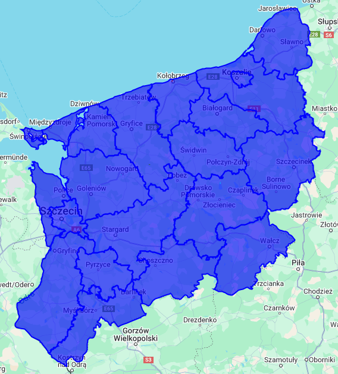
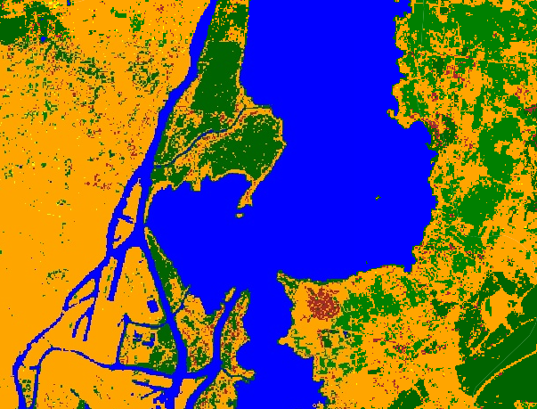
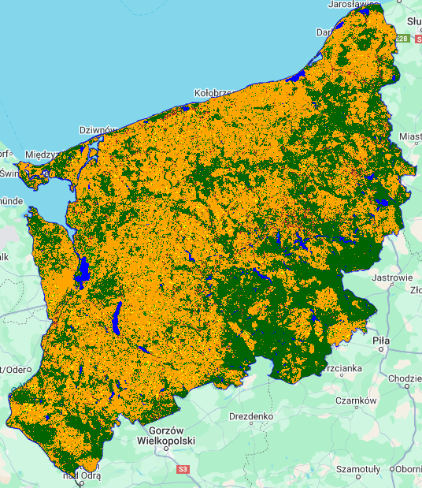

# Project Goal

The goal of the project was to conduct a land cover analysis for the West Pomeranian Voivodeship (Zachodniopomorskie) in Poland using Landsat 8 satellite data. The analysis applied image classification techniques with the Random Forest algorithm, utilizing training polygons to assign appropriate land cover classes to image pixels.  

# Input Data

The project relied on Landsat 8 (LC08) satellite data available in Google Earth Engine, specifically using Top of Atmosphere (TOA) imagery from the period between May 1 and October 31, 2024. The imagery was selected to minimize cloud cover by sorting the images based on cloud percentage, and the 20 images with the least cloud cover were selected.

The data were clipped to the region of the West Pomeranian Voivodeship, which was loaded as an administrative boundary (FeatureCollection from FAO/GAUL).  

# Data Preparation

The first step in the project was to load the boundaries of the West Pomeranian Voivodeship into Google Earth Engine and display them on the map. Next, the analysis period (2024) was defined, and start and end dates were set for the image collection. Landsat 8 images were downloaded, and the cloud cover was assessed, ensuring that the most suitable images were chosen for analysis.

# Image Processing

Next, the selected Landsat images were processed to create an RGB composite using the visible bands (B4, B3, B2). Cloud pixels were masked out using a cloud mask, and the RGB image was adjusted for brightness and contrast, improving the visual quality of the output.

# Training Polygons Creation

To perform the classification, training polygons were created for the land cover classes of interest. Six classes of land cover were identified and associated with the following reference points:
- **Agriculture** (class 2)
- **Bare Soil** (class 1)
- **Forest** (class 3)
- **Water** (class 0)
- **Low-Density Housing** (class 4)
- **High-Density Housing** (class 5)

Colors: `var landcoverPalette = ['blue', 'brown', 'green', 'darkgreen', 'yellow', 'orange'];
Map.addLayer(classified, { min: 0, max: 5, palette: landcoverPalette }, 'Klasyfikacja pokrycia terenu');
`.

These polygons were used to prepare the training data, which would be used to train the classifier.

# Image Classification

Using the prepared training dataset and selected bands from the Landsat images (B2, B3, B4, B5, B6, B7), a Random Forest classifier was trained to classify the pixels. The Random Forest algorithm is widely used for satellite image classification due to its high accuracy and ability to handle high variability in the data.

# Visualization of Results

After classification, the results were visualized on the map using an appropriate color palette to represent the different land cover classes. Each class was assigned a unique color to facilitate the interpretation of the classification results.

# Exporting Results

Once the classification was complete, the results were exported as a GeoTIFF image. This format allows the results to be easily downloaded for further analysis or visualization in other GIS software. The export was done at a resolution of 30 meters, which is the standard resolution for Landsat data.

# Conclusion

This project was done using Google Earth Engine to perform a land cover classification of the West Pomeranian Voivodeship using Landsat 8 satellite data. The Random Forest algorithm was successfully applied to distinguish different land cover classes, which can be useful in spatial planning, environmental monitoring, and land management.

Future work could improve the classification process by using a larger number of training points, applying different classification algorithms, and incorporating additional satellite data (e.g., Sentinel-2).
